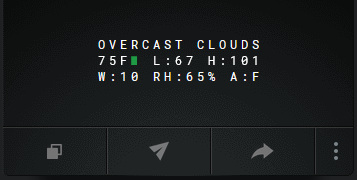
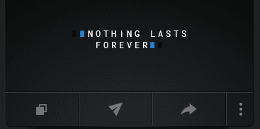
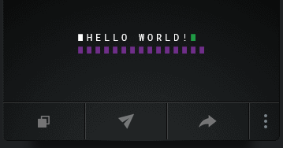

# 🚀 Vestaboard Note

Scripts to display messages to Vestaboard Note

## Description

This is a personal project. I wanted a way to automate the delivery of various random messages to a Vestaboard Note from a Raspberry Pi running raspbian (Linux) OS.
Some data sources containing quotes and sayings are managed with local files; others are pulled from API sources from the internet.

## 📌 Table of Contents
- [🚀 Vestaboard Note](#-vestaboard-note)
  - [Description](#description)
  - [📌 Table of Contents](#-table-of-contents)
  - [🔥 Getting Started](#-getting-started)
    - [Prerequisites](#prerequisites)
    - [⚡Installation](#installation)
    - [💡 Usage](#-usage)
      - [Python Scripts](#python-scripts)
      - [Bash Scripts](#bash-scripts)
  - [📝 Reference](#-reference)


## 🔥 Getting Started

### Prerequisites

* python3
* Vestaboard API Key
* OpenWeather API Key
* Finnub.io API Key
* Google API key for pulling google calendar events
* [Vestaboard Note](https://www.vestaboard.com/note)

### ⚡Installation

1. Clone github project
```
git clone https://github.com/NernaGoo/vesta.git
```
2. Set up virtual env
```
sudo apt update
sudo apt install python3-venv python3-pip
python3 -m venv .venv
source .venv/bin/activate
```
3. Install python modules
```
pip install dotenv argparse requests
``` 

### 💡 Usage

+ Create .env file containing API keys, file locations, latitude and longitude of weather location
> EXAMPLE .env file:
```
FINNHUB_API_KEY="ooooooooooooooooooooooo"
VESTA_API_KEY="ooooooooooooooooooooooo"
LOCAL_VESTA_API_KEY="ooooooooooooooooooooooo"
WEATHER_API_KEY="ooooooooooooooooooooooo"
LAT="ooooooooooooooooooooooo"
LON="ooooooooooooooooooooooo"
WORD="ooooooooooooooooooooooo"
QUOTE="ooooooooooooooooooooooo"
JOKE="ooooooooooooooooooooooo"
INSPIRATION="ooooooooooooooooooooooo"
TRIVIA="ooooooooooooooooooooooo"
WEATHER_JSON="ooooooooooooooooooooooo"
AIR_JSON="ooooooooooooooooooooooo"
```

  
+ A cronjob runs hourly from a raspberry pi. The cronjob rotates between all messaging scripts.

```
$ crontab -l
# Runs every hour, starting in the morning
47 9-20 * * * /home/pi/.venv/bin/python /home/pi/vesta/vestaboard_note.py
```


#### Python Scripts
+ [config.py](config.py)
   > Shared python modules and default vestaboard configuration


+ [weather_vesta.py](weather_vesta.py)
  > Requires latitude and longitude coordinates for weather location (add to .env file)
  ```
    $ ./weather_vesta.py
  Fetching Weather DATA...
    Success!
  Fetching Air Pollution DATA...
    Success!
  Fetching forecast data...
    Success!
  Composing output with VBML characters...
  characters: [[0, 0, 3, 12, 15, 21, 4, 19, 0, 35, 36, 6, 63, 0, 0], [12, 50, 32, 35, 0, 8, 50, 27, 36, 36, 0, 23, 50, 29, 0], [0, 0, 18, 8, 50, 29, 36, 54, 0, 1, 50, 6, 0, 0, 0]]
    Success!
  ```
    Vestaboard Note Display:

    


+ [msg_vesta.py](msg_vesta.py)
  + Send a random message based on genre:
  ```
      $ ./msg_vesta.py -h
    usage: msg_vesta.py [-h] [-g {QUOTE,JOKE,INSPIRATION,TRIVIA,WORDS} | -m MESSAGE]

    options:
      -h, --help            show this help message and exit
      -g {QUOTE,JOKE,INSPIRATION,TRIVIA,WORDS}, --genre {QUOTE,JOKE,INSPIRATION,TRIVIA,WORDS}
                            Choose a genre. Default is 'quote'
      -m MESSAGE, --message MESSAGE
                            Send a message using single-quotes in 45 characters or less.

      $ ./msg_vesta.py -g quote
      Choice: QUOTE
      Composing output with VBML characters...
      characters: [[70, 67, 14, 15, 20, 8, 9, 14, 7, 0, 12, 1, 19, 20, 19], [0, 0, 0, 6, 15, 18, 5, 22, 5, 18, 67, 70, 0, 0, 0], [0, 0, 0, 0, 0, 0, 0, 0, 0, 0, 0, 0, 0, 0, 0]]
        Success!

      Message: Nothing lasts forever
  ```

    Vestaboard Note Display:

    
  
  + Send your personal message to the vestaboard note:
  ```
   ./msg_vesta.py -m "Hello World!" 
  character_array: Hello World!
  Composing output with VBML characters...
  characters: [[69, 8, 5, 12, 12, 15, 0, 23, 15, 18, 12, 4, 37, 63, 0], [63, 63, 63, 63, 63, 63, 63, 63, 63, 63, 63, 63, 63, 63, 63], [0, 0, 0, 0, 0, 0, 0, 0, 0, 0, 0, 0, 0, 0, 0]]
    Success!
  Sending message to the Vestaboard Note...
    Success!

  Message: Hello World!
  ```

  Vestaboard Note Display:

  


+ countdaysvesta.py
+ onthisdayvesta.py
+ history.py
+ quotes_vesta_local.py
+ today_vesta.py
+ vestaboard_note.py
  > Executes a random script to rotate through different kinds of messages for variety (weather, jokes, trivia, vocabulary, inspirational notes, etc.)


#### Bash Scripts
+ defaultvesta.sh
+ eventsvesta.sh
+ morningvesta.sh
+ nexteventvesta.sh
+ stockvesta.sh
+ update_events.sh

## 📝 Reference

* [Vestaboard Cloud API](https://docs.vestaboard.com/docs/read-write-api/introduction/)
* [Finnhub](https://finnhub.io/docs/api/quote)
* [OpenWeather](https://openweathermap.org/api/current?collection=current_forecast)